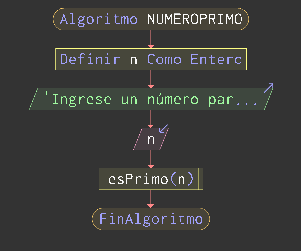
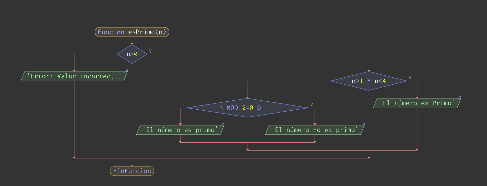

# Tema 1: Fases de desarrollo de un algoritmo y verificación 
---
## Ejercicio 1: Pasos de la fase de programación
---
### Análisis del problema

La resolución del problema del número primo es ver y analizar los inputs del usuario y determinar si cumple diferentes condiciones para verificar si el número que ingreso es primo o no. Para ello, las condiciones que deberá a cumplir este número son:
-   Debe ser mayor a 1.
-   Debe ser solamente divisible por 1 y por si mismo.
-   En caso de que un número sea negativo, debe dar un error.

---

### Diseño

En el _**diseño**_ del programa, se debe establecer primero una pregunta de entrada donde se establezca la incógnita o el pedido al usuario que ingrese un número natural entero, en lo posible ya pedirle en la misma consigna. Una vez hecho eso el usuario ingresará el número correspondiente y de ahí se correrá el subprograma de **esPrimo**, donde se establecerán las condiciones vistas en apartado anterior, si se cumple, se imprimirá un valor booleano con una cadena que diga “Si, el número es primo”, caso contrario, se imprimirá “No, el número no es primo”

En el siguiente diagrama, podremos observar como se empezaria el código y como se iria moviendo entre decisiones o si se cumplen ciertas condiciones hasta el final del programa.

---

### Tabla de Valores

Para poder determinar los casos límites, de error o donde el valor será primo o no, se determina esta tabla para verificar las condiciones y que valor debería devolver el algoritmo.

| Valor ingresado | Tipo de Caso | Valor que retorna el programa |
|---------|------|-----|
| 1 | Caso Límite  Mínimo| No es primo
| 0 o número negativo | Error | Valor Incorrecto 
| 2 | Caso Límite mínimo primo | Es primo
| 4 | Caso normal | No es Primo
| 2,147,483,647 | Caso Límite máximo (Por _**Integer Overflow**_) | Es Primo

#### Diagrama del algoritmo principal

{width=50%}

#### Diagrama de la función esPrimo

---

### Pseudocódigo _(Hecho en Pseint)_

    Funcion esPrimo(n)
        Si n > 0 Entonces
            Si n > 1 y n < 4 Entonces
                Escribir "El número es Primo"
            SiNo
                Si n mod 2 = 0 o n mod 3 = 0 Entonces
                    Escribir "El número no es primo"
                SiNo
                    Escribir "El número es primo"
                FinSi
            FinSi
        SiNo
            Escribir "Error: Valor incorrecto, vuelva a ingresar un número mayor a 0"
        FinSi
        
    FinFuncion

    Algoritmo númeroPrimo 
        Definir n Como Entero
        Escribir "Ingrese un número para determinar si es primo o no"
        Leer n
        esPrimo(n)
        
    FinAlgoritmo

